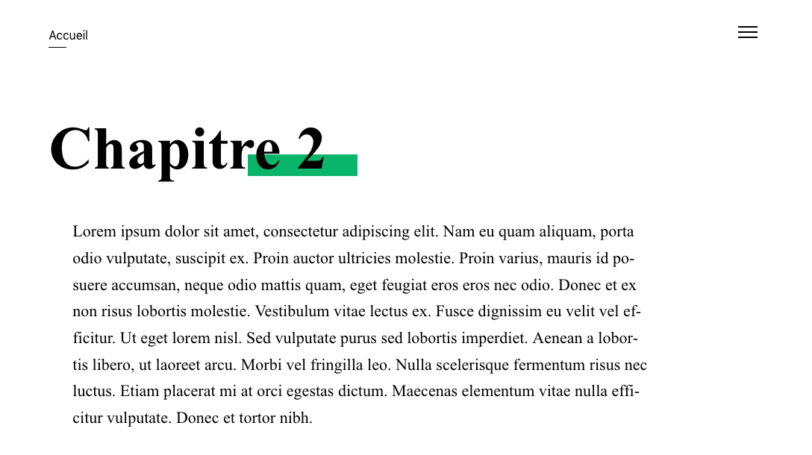

# Hugo LivreNum 

Un modèle de livre numérique avec [Hugo](https://gohugo.io/).



## 📝 Prérequis

- Un terminal
- [Hugo](https://gohugo.io/), un générateur de site statique
- [NodeJS](https://nodejs.org/), environnement pour construire les styles

```bash
git clone https://github.com/loup-brun/hugo-livre-numerique.git

# se déplacer dans le répertoire
cd hugo-livre-numerique

# installer les dépendances NodeJS
npm i
```

## Configuration

Avec un éditeur de texte, modifier le fichier `config.yml` (titre, auteur, description, etc.).

## Rédaction

Tous les documents sont dans le dossier `content`/.

## 💻 Local

```bash
make serve
```

## 📦 Production

```bash
make build
```

Les fichiers seront placés dans le dossier `public/`.

## Licence

[CC-BY-SA 4.0](LICENSE)
